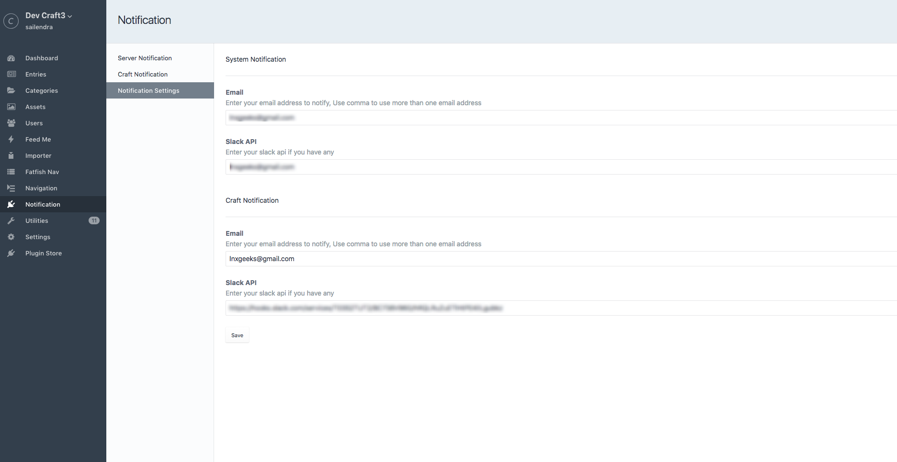
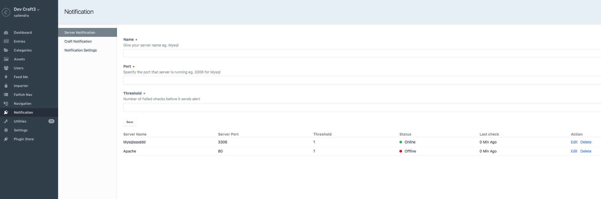
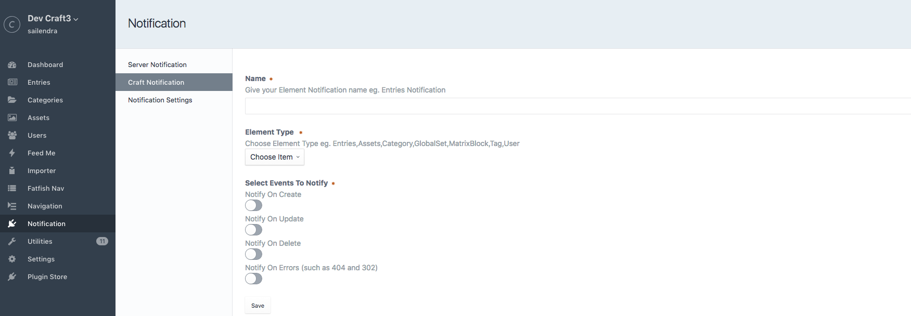

# Notification plugin for Craft CMS 3.x

Notification plugin for craft 3.x

## Requirements

This plugin requires Craft CMS 3.0.0-beta.23 or later.

## Installation

To install the plugin, follow these instructions.

1. Open your terminal and go to your Craft project:

        cd /path/to/project

2. Then tell Composer to load the plugin:

        composer require fatfishdigital/notification

3. In the Control Panel, go to Settings → Plugins and click the “Install” button for Notification.

## Notification Overview

The Craft Notification plugin allows a Site Administrator or a Content Administrator to monitor activities on a Craft site.

Currently, this plugin provides notifications via Slack and Email for "Entries", "Assets", "Users" and "Categories".  

For example, this plugin will send a notification when an entry is created/edited/updated/deleted by a user(s).

This plugin also checks for service status (Apache, MySQL, FTP, etc.) and notifies you when the service is down.

## Configuring Notification

## Using Notification

Using this plugin is simple – all you need is to have a Slack account and an email address where you would like the notifications to be sent.

Select the options that you would like to be notified about and that's it. You're ready to go.

Service status notifications and Craft notifications can be configured to be sent to different parties. This feature is handy when you want to send Technical issues to your Developers and any site issues to your Web Administrators.

Made with love by [Fatfish](https://fatfish.com.au)
